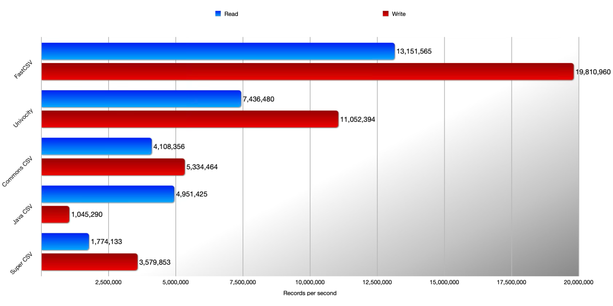

The development of FastCSV is guided by a set of design goals.

## Performance

FastCSV is engineered for exceptional speed, optimized for rapid CSV file reading and writing.
It achieves high performance without compromising on CSV specification compliance, robustness, or security.

## Lightweight

FastCSV is designed to be lightweight. It has no external dependencies and ensures a small memory footprint.

The Jar-File of version 3.2.0 has a size of only barely above 64 KiB.

## Compliant

FastCSV is designed to comply with the CSV specification [RFC 4180](https://datatracker.ietf.org/doc/html/rfc4180).

Its very high [test coverage](https://app.codecov.io/gh/osiegmar/FastCSV) ensures that it adheres to the specification.
See also the [Java Csv Comparison Project](https://github.com/osiegmar/JavaCsvComparison) on how FastCSV handles edge cases and how it compares to other
libraries.

## Simplicity

FastCSV is designed to be simple and intuitive. It provides a simple API that is easy to use and understand.
See the [Quickstart](/guides/quickstart/) for a first impression.

## Robustness

FastCSV is designed to be robust and reliable. [Thoroughly tested](https://app.codecov.io/gh/osiegmar/FastCSV),
it ensures a high level of stability.
[PIT mutation testing](https://pitest.org) is used to ensure the quality of the tests.

While FastCSV accepts null inputs for certain and documented methods, it does not return null values in any of its public APIs.

## Security

FastCSV is designed to be secure.

We follow the Open Source Security Foundation (OpenSSF) Best Practices.
See our [Best Practices](https://www.bestpractices.dev/projects/9141) report for more information.

FastCSV is also part of the [OSS-Fuzz](https://google.github.io/oss-fuzz/) project to ensure its security.

## Documentation

FastCSV is designed to be well documented. It offers comprehensive documentation for all features.

This website along with the [Javadoc](https://javadoc.io/doc/de.siegmar/fastcsv)
provides detailed information on how to use the library.

## Maintainability and Support

FastCSV is designed to be maintainable to ensure its longevity, continued development and support.
Checkout our [FAQ](/faq/) for more information on how to get help and how to contribute.

[Spotbugs](https://spotbugs.github.io),
[PMD](https://pmd.github.io),
[Error Prone](https://errorprone.info),
[NullAway](https://github.com/uber/NullAway) and
[Checkstyle](https://checkstyle.sourceforge.io) are used to ensure the quality of the code.

## Non-Goals

While flexibility and extensibility are important, they are not considered as design goals. They are only considered if
they do not conflict with the design goals listed above.
